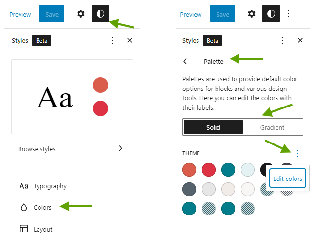

# 🍱 Customization

This theme offers comprehensive support for full site editing, allowing you to easily customize various elements of your website. You can effortlessly change the logo, update the navigation menu, and even create your own post templates. With these powerful features, you have the flexibility to tailor your website to your exact preferences and requirements.

## Full site editing

Full Site Editing (or "FSE") is a group of connected capabilities that enables you to use blocks to update your entire website. As a result, there are more applications where you may use the Block Editor's comfortable and flexible experience.

To start making changes to the website, navigate to `Appearance > Editor`

:::tip
**TL;DR** — Browse through the **Templates** and **Patterns > Template parts** menu in the full site editor and make any changes you wish! You can revert the changes at any time.
:::

### How to determine the template that corresponds to the page

The easiest way is to browse your page with [admin bar enabled](https://www.wpbeginner.com/wp-tutorials/how-to-fix-missing-admin-bar-issue-in-wordpress/#:~:text=To%20check%20this%2C%20simply%20go,page%20to%20save%20your%20settings.) and then click the button **Edit site** located in the admin bar. This will take you to editing the template of the page.

## Changing website logo

1. Navigate to `Appearance > Editor > Templates` and choose any template.
2. In the template editor, Click **Site logo** block and click **Replace**. Choose or upload new website logo.
3. If you prefer to use a logo picture only you may remove the **Site title** block.
4. Finally, click **Save** to apply your changes.
5. Now all templates that use the **Site logo** block will be updated automatically except some templates that has own logo image block. You may check again in the template editor.

## Editing navigation menu

1. Navigate to `Appearance > Editor > Template` and choose any template.
2. Click on the **Navigation block** in the template. For fresh installations, you might see the message "Navigation menu has been deleted or is unavailable." This is the Navigation block; you can click on it.
3. Go to the Block options panel on the right side of the screen.
4. You can create a new menu by clicking the **Create new menu** link.
5. If you have an existing navigation menu, click the triple-dots button of the Menu section, then select the desired menu.
6. You can drag and drop menu items to reorder them.
7. Finally, click **Save** to apply your changes.

## Changing the header layout for entire site

1. Navigate to `Appearance > Editor > Template` and choose any template.
2. Click the **Header** block and click the **Options** button (triple dots) of the Header block.
3. Open the List view panel and choose a new layout in the **Design** section.
4. Finally, click **Save** to apply your changes.

## Changing the header layout for a specific template

1. Navigate to `Appearance > Editor > Templates`, then choose any template you prefer to change the header.
2. Open the List view panel and click the **Options** button (triple dots) of the Header block, then select **Replace Header**.
3. Select the desired header.
4. Finally, click **Save** to apply your changes.

## Changing the default template layout

Many templates in the section `Templates` of the Site Editor have various layouts. You can easily change them by following the instructions below

1. Navigate to `Appearance > Editor > Templates`, then choose any template you prefer to change.
2. Go to the Template option on the right side of the screen. Click the triple dots button and select **Replace template**.
3. Select the desired template.
4. Finally, click **Save** to apply your changes.

## Editing colors

1. Navigate to `Appearance > Editor` and click the **Styles** button at the top right of the screen.
2. In the Styles panel, Click **Colors > Palette**. The theme's solid colors and gradient colors will be shown.
3. To edit the color, Click the 3-dots button in the Theme section and choose **Edit colors** or **Edit gradients**.
4. Now you can change any color. After finished, Click **Done**.
5. Finally, click **Save** to apply your changes.

## Editing widgets & sidebar

There are no longer any widgets like there were in classic-themes because this theme offers full site editing.

In the full site editor, there is a sidebar template that you can edit or create your own sidebar.

1. Navigate to `Appearance > Editor > Patterns > Template parts` and choose a template named **Sidebar** or create your own template by clicking the **Add new** button and select the **Sidebar** area.
2. Add any block you want to the sidebar template.
3. Finally, click **Save** to apply your changes.
4. You can use the sidebar template on any page by adding a Template part block and choosing the desired sidebar.

## Customize post or page templates

1. Navigate to `Appearance > Editor > Templates`.
2. To customize post template, Select the template **Single Posts**.
3. To customize page template, Select the template **Pages**.
4. Modify the template as you wish. All changes will be kept in the database and you can revert it later.
5. Finally, click **Save** to apply your changes.

## Adding Social Links

Follow these steps to add social media links to your site:

1. Navigate to **Appearance > Editor > Templates** in your WordPress dashboard.
2. Click the **Plus (+)** button in the toolbar, then select the **Social Icons** block.
3. The **Social Icons** block will be added to the editor.
4. Inside the Social Icons block, click the **Plus (+)** button to add a new social media icon.
5. Choose the social network you want to add from the list of available options.
6. Enter your social network URL and click the **Apply** button to save the link.

You can repeat these steps to add multiple social media icons for different platforms.
