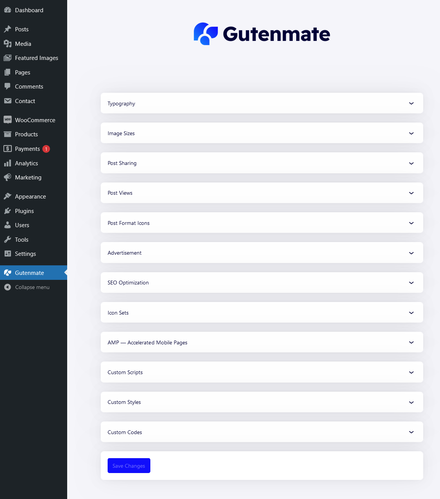

# Theme Options

The Gutenmate plugin has a dedicated setting page to allow user choose the way of gutenmate plugin works.

## Setting page
The setting page can be accessed from admin menu `Admin > Gutenmate`. You will see the page as the following.

Gutenmate allow you configure these options

* **Typography** Configure a default font stacks while webfont is loading. If the theme is supports Gutenmate, You can override the typography settings (family and weight) from this section.
* **Image Sizes** Configure an image sizes for using in your website. After made a change, Please regenerate by using [this plugin](https://wordpress.org/plugins/regenerate-thumbnails/)
* **Post Sharing** Configure a site-wide options for Post Share block.
* **Post Views** Configure a site-wide options for Post Views block. The post view feature requires [this plugin](https://wordpress.org/plugins/wordpress-popular-posts/) to be working.
* **Post Format Icons** Configure a site-wide options for Post format icons.
* **Advertisement** Add an advertisement code for the pre-defined ad locations.
* **SEO Optimization** Configure an essential SEO optimization. If you're using an advanced SEO plugin, Please disable all options in this sections.
* **Icon Sets** Configure an icon set to be used. Turn on an icon pack to get more icons!
* **AMP** Configure options for AMP pages.
* **Custom Scripts** Add any JS code into all pages.
* **Custom Styles** Add any CSS code into all pages.
* **Custom Codes** Add any HTML code into the head tag of all pages.

Click the button **Save Changes** after made a change.

## Additional options

Gutenmate provides an additional option for creating great informative content.

### Author profile options

1. Navigate to `Users > All users` and click the user you want to edit.
2. Or navigate to `Users > Profile` for editing the current user.
3. At user edit page, scroll down to the **Additional options** section.
4. An additional option for the current user is here.

### Post options

1. Navigate to `Posts > All posts` and click the post you want to edit.
2. At post edit page, Go to sidebar and click the **Post** tab.
3. Additional option are as follows:
	- **Recipe summary** This is a field set for creating a post about a food recipe. Enter information related to the field. To display these information in the content, Please use the **Custom field** block in the correspondent variation.
	- **Place summary** This is a field set for creating a post about a hotel, restaurant, etc. Enter information related to the field. To display these information in the content, Please use the **Custom field** block in the correspondent variation.
	- **Event summary** This is a field set for creating a post about a event, seminar, exhibition etc. Enter information related to the field. To display these information in the content, Please use the **Custom field** block in the correspondent variation.
	- **Alternative featured image** The image selected in this option will be used in the **Post featured image** gutenmate block when the option **Use alternative featured image if available** of the block is enabled.