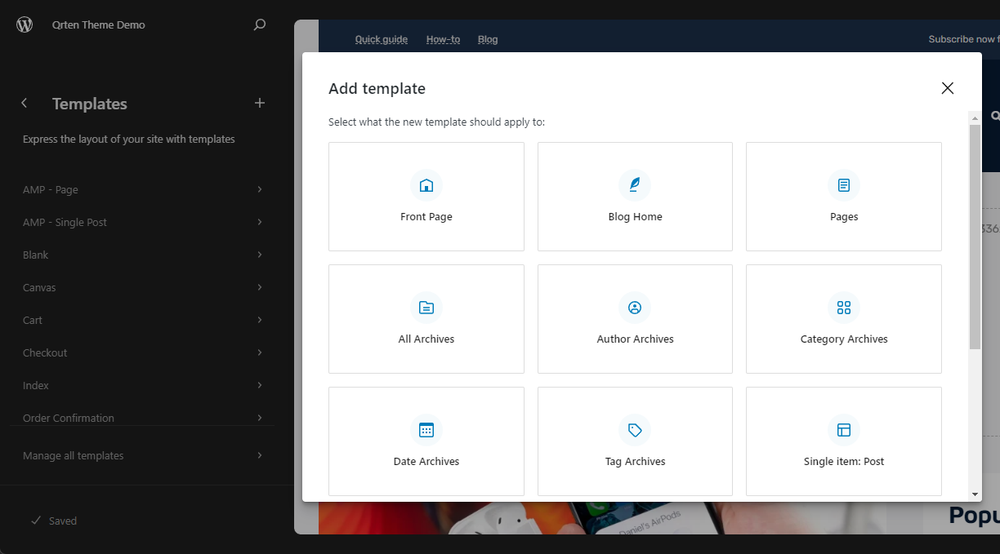

# 🦫 Setting Up

After successfully installing our theme, it's time to bring your website to life. In this section, we'll guide you through the essential steps to configure and customize your site to align with your unique vision. Whether you're a WordPress beginner or an experienced user, you'll find clear instructions and tips to make the setup process a breeze. Let's dive in and transform your website into a powerful platform that suits your needs and style.

<iframe width="560" height="315" src="https://www.youtube-nocookie.com/embed/sYPRss7w9RY?si=o8cYOkb3-Hy3s1OC" title="YouTube video player" frameborder="0" allow="accelerometer; autoplay; clipboard-write; encrypted-media; gyroscope; picture-in-picture; web-share" allowfullscreen></iframe>

## Adding website logo

1. The website logo can be changed from any template. In this step, we will use the front page template.
2. Go to the front page template by clicking the template from the site editor menu and selecting front page from the list.
3. Click on the template preview to enter the template editing screen.
4. The logo block can be found in the site header. Click on the logo area and click the blue upload button.
5. Choose your own logo image and click the select button.
6. You can adjust some properties of the site logo in the block properties panel on the right side of the screen, such as logo width.
7. To adjust the logo width for a mobile screen, click "Styles" in the block properties panel.
8. In the "Dimensions" section, you can change the display width for each screen size.
9. Click the "Save" button after you've finished.

## Adding primary navigation menu

1. The primary navigation menu can be changed from any template that has this block inside. In this step, we will use the front-page template.
1. Go to the front-page template by clicking the template in the site editor menu and selecting "Front Page" from the list.
1. Click on the template preview to enter the template editing screen.
1. The primary navigation menu can be found in the site header. Click on the link "Create a new menu."
1. Go to the block properties panel on the right side of the screen. Click the plus button to add a new menu item.
1. Choose "Page Link" to create a link to any pages or posts on your website.
1. In the popup box, enter a title for the linked page and click on the desired page in the results.
1. Now the page link has been added. This is the top-level menu item.
1. Next, create a submenu by clicking the triple-dots menu of the page link and select the option "Add submenu link."
1. A popup for adding a new menu item will appear. Repeat the same steps for adding menu items.
1. The next step is to give a name to this menu for easy reuse.
1. Click on "Settings" in the block properties panel.
1. Scroll down to the "Advanced" section and type the menu name as "Primary navigation."
1. Click the "Save" button after you've finished.

## Adding mobile navigation menu

1. The primary navigation menu can be changed from any template that has this block inside. In this step, we will use the front-page template.
1. Go to the front-page template by clicking the template in the site editor menu and selecting "Front Page" from the list.
1. Click on the template preview to enter the template editing screen.
1. Scroll down to the sliding panel block. It should be near the bottom of the screen.
1. Click on the sliding panel block. You will see a floating panel, and the mobile menu is not yet created.
1. Click on the link "Create a new menu" and follow the same steps for editing the menu.
1. Click the "Save" button after you've finished.

## Creating a default single post template

1. On the site editor screen, click on the "Templates" option in the Site Editor menu.
2. Choose "Single item post" as your template category.
3. You will find a list of all predefined templates for use as a default template for posts. Pick one of your favorites. The chosen template will be used for all posts.
4. To apply it, click the "Save" button.
5. If you want to change to other predefined templates, Simply delete this template and repeat the same steps.

## Creating a default page template

1. On the site editor screen, click on the "Templates" option in the Site Editor menu.
2. Choose "Pages" as your template category.
3. You will find a list of all predefined templates for use as a default template for pages. Pick one of your favorites. The chosen template will be used for all pages.
4. To apply it, click the "Save" button.
5. If you want to change to other predefined templates, Simply delete this template and repeat the same steps.

## Creating archive page

1. On the site editor screen, click on the "Templates" option in the Site Editor menu.
2. Choose "All Archives" as your template category.
3. You will find a list of all predefined templates for use as an archive page. Pick one of your favorites. The chosen template will be used for all archive pages.
4. To apply it, click the "Save" button.
5. If you want to change to other predefined templates, Simply delete this template and repeat the same steps.

## Creating blog page

1. On the site editor screen, click on the "Templates" option in the Site Editor menu.
2. Choose "Blog Home" as your template category.
3. All predefined templates for use as a blog page will be listed. Choose one of your favorites. The selected template will be applied to the new blog page.
4. Click "Save" to apply the default blog page.
5. If you want to change to other predefined templates, Simply delete this template and repeat the same steps.

## Creating homepage

1. In the site editor screen, click on the "Templates" option in the Site Editor menu.
2. Choose "Front Page" as your template category.
3. You will see a list of all predefined templates for use as a front page. Pick one of your favorites. The chosen template will be used for the front page.
4. To apply it, click the "Save" button.
5. If you want to change to other predefined templates, Simply delete this template and repeat the same steps.

Now your website is ready. Feel free to explore the Site Editor and unleash your creativity. This theme provides robust support for full site editing, enabling you to effortlessly customize every aspect of your website. Whether it's adjusting the logo, refining the navigation menu, or crafting your unique post templates, you have the tools to shape your site precisely to your liking. Embrace these powerful features and transform your website to match your vision and meet your specific needs.