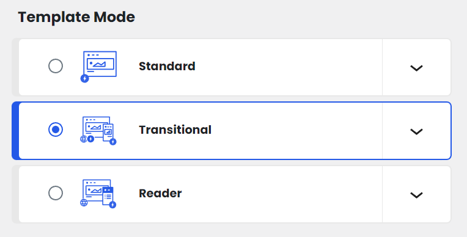
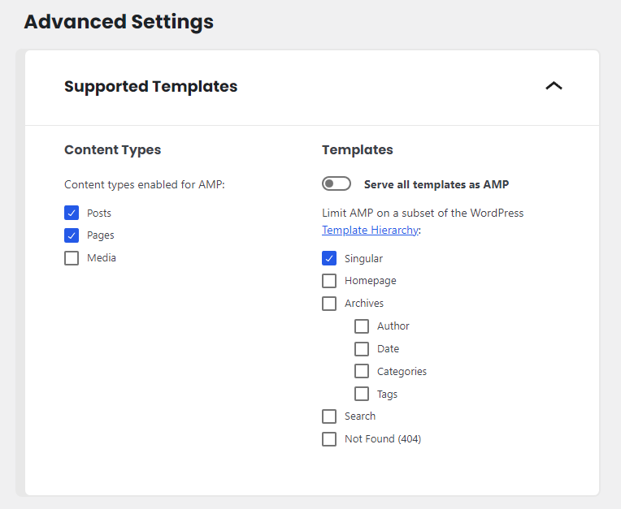

# AMP

The AMP plugin for WordPress empowers you to create blazing-fast, mobile-optimized web pages that load instantly on mobile devices. Developed by the AMP Project, this plugin streamlines your website's content for maximum speed and user experience, enhancing search engine rankings and mobile engagement. With AMP, you can provide your audience with lightning-fast access to your content, improving overall performance and ensuring a seamless browsing experience across all devices.

## Setting up AMP plugin

Please follow the below instruction to enable the AMP page.

1. Install and activate the [AMP plugin](https://wordpress.org/plugins/amp/).
2. Navigate to `AMP > Settings` and set the **Template mode** option to **Transitional**.

3. In the **Advanced Settings** section, Uncheck the option **Serve all templates as AMP** and only the **Singular** box should be checked.

## Editing AMP templates

Navigate to `Appearance > Editor > Template Parts`. All templates that begins with **AMP** is for displaying AMP page as the following

- `AMP - Page` for displaying individual page.
- `AMP - Single Post` for displaying individual post.

In case you need to create a template for other pages such as home page or archive page. Click the `Add New` button and enter template name. All available template names as the following

- `AMP - 404` for displaying the 404 page.
- `AMP - Search` for displaying the search page.
- `AMP - Front page` for displaying the front page.
- `AMP - Archive` for displaying the archive page.
- `AMP - Attachment` for displaying the attachment (media) page.

After created the new AMP template, Navigate to `AMP > Settings` and recheck the supported templates in the **Advanced Settings** section.
